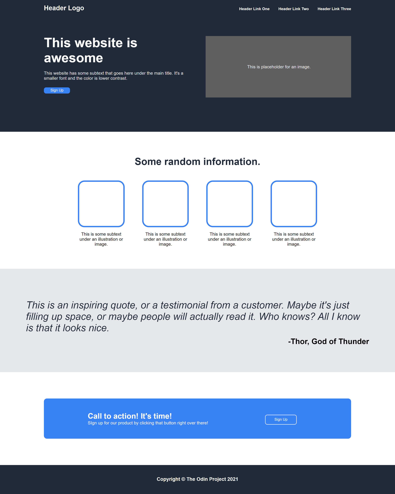

# Odin-Landing-Page
A vanilla HTML and CSS website Landing Page to study the use of fundamental concepts. A project assigned in the Web Development course by the Odin Project. The main concept utilized in this project is Flexbox and its respective properties.

# The Website
## *My Version*

## *The Odin Website*

# How To Run
Running this project is very simple, either fork the repository and clone it yourself using the Github link, or download the zip code and run it in your IDE / Code Editor. If you just want to see the website, you can also just download the zip and execute the HTML file.
